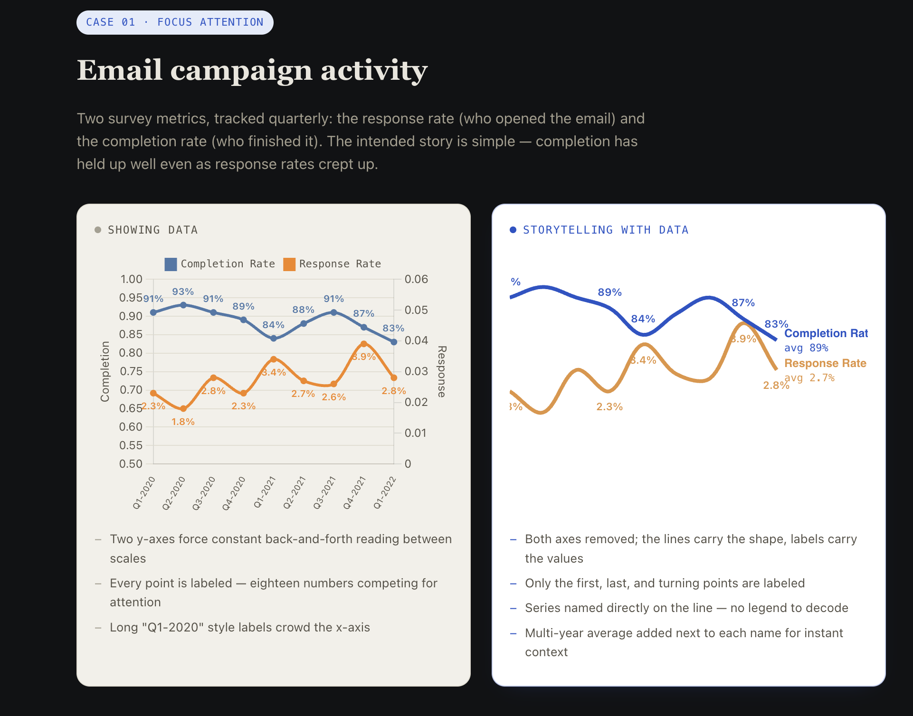

# Storytelling with Data

** <a href="https://carolinekarimi.github.io/storytelling-with-data/" target="_blank" rel="noopener noreferrer"><strong>→ View the live page</strong></a> **

I keep landing in rooms where the analysis was right and the room still didn't move — because the chart made someone work for the point instead of handing it to them. This repo is that habit made visible: eight charts, each rebuilt twice from the same numbers — once the way most tools default to, once the way it should look when the point actually lands.

Every pair starts from the same source data. The "showing data" panel is what most tools give you by default: every axis, every label, every color a chart type can hold. The "storytelling with data" panel is what's left after deciding what the chart is actually *for*.

The practice data behind every chart is in [`practice_data.xlsx`](practice_data.xlsx) — one tab per case study, download it and see if you'd have made the same calls.

Built with plain HTML, CSS, and Chart.js. No framework, no build step.

---

## The thinking behind it

Any data visualization tool can create a graph to show your data, but none of them knows your data or organization as you do. Exploring storytelling with data enables you to bring your data to life.

### Choosing an effective visual

* **Simple text** - If you have a number or 2 to communicate, use the numbers and make them prominent with a few supporting words to make your point. Putting only a couple of numbers in a graph or table simply makes them lose their oomph.

  * Leverage font size to help aid your point.

* **Tables** - Tables are good for communicating with audiences whose members will each look for their rows of interest or communicating different units of measure

  * Avoid using tables in live presentations - odds are there is a better way to pull out and visualize the pieces or piece of interest. If you are losing too much by this, consider including the full table in the appendix and use a link or reference to it.
  * The table design should fade into the background, data takes center stage.
  * Use light borders, greyed out or remove them and use white space to set apart table elements.

* **Heat Maps** - This is a special case of tables that leverages colored cells to convey the relative magnitude of the numbers.

  * Always include a legend - e.g a low to high subtitle with respective colors.

A well-designed graph will always get information across more quickly than a well-designed table.

* **Scatter Plot** - Effective for showing relationships between two things.

  * Consider your intention, and what you want to draw attention to, and leverage color, text and font size.

* **Line graph** - very effective for plotting continuous data, often some unit of time (days, months, quarters, years).

  * **Standard line graph** - can show one, two, or multiple series of data.
  * **Slope graph** - effective for showing relative increases/decreases/differences across various categories when you have 2 periods or points of comparison.
  * Data plotted should always be in consistent intervals.
  * If plotting a summary statistic like an average or point estimate of a forecast, consider also visualizing the range.
  * If many lines overlap in a slope graph, consider using another chart type or using color to emphasize important categories.

* **Bar charts** - bars should be a go-to chart when plotting categorical data where information is organized in groups.

  * **Vertical bar chart** - Can be used with single, two, or multiple series but as you add more series it becomes harder to focus on one at a time. The relative order of categorization is always important.
  * **Stacked vertical bar chart** - Allows comparison across categories while at the same time showing subcomponents of each category. Consider adding absolute numbers for each category in the graph to aid interpretation.
  * **Waterfall chart** - Used to pull apart pieces of a stacked bar chart to focus on one at a time, or show the starting point, increase or decrease, and resulting endpoint.
  * **Horizontal bar chart** - This should be the go-to chart for categorical data; they are extremely easy to read and are good for long category names. Category ordering is important — if the biggest/lowest category is most important, put it first.
  * **Stacked horizontal bar chart** - Shows totals across categories and subcomponents of the categories. 100 percent stacked is preferred over showing absolute values.
  * They should always have a zero baseline.
  * Y-axis labels should be on the left side of the visual.
  * Data labels should be inside bars to reduce clutter.
  * If data labels are outside, omit Y-axis labels to reduce redundancy.
  * When choosing between axis and data labels, consider the level of specificity you need:
    * If the intent is to show big-picture trends, preserve both labels and de-emphasize axis labels — grey them out.
    * If the intent is to emphasize specific numerical values, keep data labels and omit axis labels.
  * Bar width should always be wider than the whitespace between them, but not too wide, as this risks width comparison by your audience.

### Visuals to avoid

* **Area charts** - People's eyes do not do a great job of attributing quantitative values to two-dimensional space, making them hard to read. Avoid them unless you need to visualize numbers of vastly different magnitudes.
* **Pie charts** - If you find yourself using a pie chart, ask yourself why. If you can answer, that's okay — but it shouldn't be the first graph you reach for. Replace these with a horizontal bar chart (ordered).
* **Donut charts** - While pie charts ask the audience to compare angles and areas, donut charts require a comparison of arc lengths. Do not use donut charts.
* **3D** - Never use 3D. It skews numbers, making them difficult or impossible to interpret or compare.
* **Secondary axis** - Useful when comparing data of different units against the same x-axis, but avoid the use/display of the secondary axis itself. Instead:
  * Don't show the secondary axis — label the points belonging to it directly.
  * Pull the graph apart vertically and use the same x-axis but a different y-axis.
  * If you need to show both axes, link each axis and its data through the use of color.
